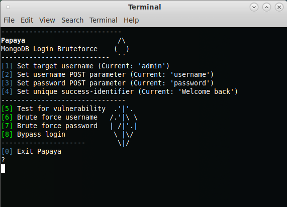

# Papaya



Papaya is a tool to test if a MongoDB/NoSQL-based web application is vulnerable to a basic nosql injection on POST login forms, including tests for password and username extraction.

### Usage
```
python3 papaya.py TARGET_URL
```
### Dependencies

pip install -r requirements.txt
